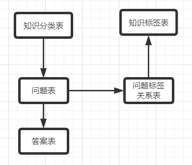

#  脚手架工程 - 研发规范与示例代码工程
1. StaggingProject_Core：无业务特征的核心框架代码类工程(如:缓存客户端、PRC工具类、服务治理等)
2. StaggingProject_Pojo：与数据库表一一对应DO存放工程
3. StaggingProject_Module_Knowledge：业务模块代码工程(如:知识库管理工程)(引用:Core与Pojo工程)
4. StaggingProject_Web_Main：产品SpringBoot启动类,一般包含配置文件(引用各业务模块代码工程)
5. StaggingProject_Web_Job：产品附属服务引用,一般包括定时任务、报表等离线实时性不高的应用

##  全局框架
- 使用JDK8
- Spring Boot 2.2.5
- 所有产品链接同一个主数据库，从数据库只做报表、离线聚类、数据挖掘等工作

## pom命名
- groupId : com.cloud.stagging.*
- artifictId: stagging-project-模块名称
- version: 默认版本 1.0

## 代码提交规范
- 所提交的代码必须进过SonarLint检测通过 才能提交(需要将检测通过截图贴到自测报告当中)
- 每两周一次全量Sonar代码检测、每两周一次选定模块CodeReview
- 提交代码采用GitLab的Merge Request做单词任务代码审核

## 工程业务物理模型与业务模型说明
    为便于大家理解本脚手架工程中的代码，在此介绍示例代码的业务模型
    本示例代码的业务模型和物理模型如下
    
    为方便

 
###  规范：POJO使用规范  ！！！！！！未开始！！！！！！！！！！1
       DO：与数据库表一一对应，DAO层接受DO或者DTO(只有在查询的时候)，返回DO或者VO。DO写在独立POJO工程中。
       DTO：Controller入参对象，可传入Service。写在各个子工程里面
       VO：业务返回对象，用于AjaxResult.data属性。写在各个子工程里面
       AjaxResult：所有Ajax请求必须返回此对象，带状态码与说明。写在component仓库里面的core子工程view子包当中中。只能出现在Controller中。
       例：数据库quesiton表 对应 POJO Quesiton(后缀DO不加)
       例：问答总览查询接口入参 KnowledgeQueryDTO:里面放入分类、排序、创建者、答案类型、状态等条件;
                       返回 KnowledgeVO:里面有Question和AnswerList
           新建一个知识点(1个问题3个答案)入参 KnowledgeAddDTO:里面放入Question和AnswerList;
                                    返回 KnowledgeVO:里面有Question和AnswerList,里面包含了ID
       DO一定要重写toString()方法；DTO/VO toString()打印业务重要信息(如del、webId登与业务关系不大的可以不打印)，特别注意大对象不能打印(原因：大对象重写toString()方法，在调用时会有内存溢出风险)。
       所有POJO属性都需要加上数据校验注解(hibernate-validator)；接口文档注解(非强制加注解注释，Swagger2不加注解注释也能使用，只供开发人员使用)
       所有POJO不需要序列化接口(原因：没有场景使用到)
       所有POJO(DO、DTO、VO、AjaxResult)必须向前兼容
       

###  规范：工具类使用规范(任何工具类禁止实例化(禁止实例化方式：设置构造函数private权限))
       无业务工具类：全部在Core工程下的utils子包当中编写。
         例: StringUtils:是字符串判空、转换等静态工具类
             CollectionUtils：是所有容器判空、转换等静态工具类
             HttpRequestUtils: 发送Http请求等静态工具类(必须日志打印 入、出参、耗时)
             ExcelUtils: 包含Excel读取、创建等静态工具类
       有业务工具类：写在各个子工程的utils子包当中。
         例: KnowledgeUtils: 写在Knowledge工程中
             其他例子：。。。。
             其他例子：。。。。

###  事务使用规范
    1：统一在Service方法头上使用@Transactional() 
        必须添加事务原因：Service层接口存在互相调用，调用者一般不会关注被调用方法是否开启事务，为保险起见，涉及操作数据库(增删改)的方法一律添加事务
    2：查询类型类方法不允许使用@Transactional，如：getKnowledgeById()根据知识点ID查询知识点

###  常量维护规范
    1：常量统一使用枚举类管理，枚举写在仓库component的pojo工程中的enums包中。枚举可直接Ajax字符串-->DTO属性-->数据库表字段字符串， 反之亦可。
    2：同一模块中的枚举常量写在对应的子包中。不能出现大而全的枚举类。
      如：Question.type(问题类型); Answer.type(答案类型); Lable.status(标签状态)等知识库模块常量统一写在知识库子包中
    3：规范示例见： TODO

###  Mybatis使用规范(详细Demo见 TODO)
    1：Mapper.java与Mapper.xml同名，且在同一个子包当中。
    2：禁止使用resultMap映射关系，而使用 驼峰转大小写 规范：map-underscore-to-camel-case
    3：XML中jdbcType不用写，直接编写table_id = #{formid}。 通过mybatis.configuration.jdbc-type-for-null=null规范解决null问题。

###  基本资源CRUD编写规范(详细Demo见 TODO)
    1：一类资源(如分类)的CRUD先设计好物理表模型，使用Mybatis_generator工具自动生成DO,Mapper接口与MapperSQL文件后编辑业务代码
    2：Controller类上的注解:@RestController、@RequestMapping("系统名称/模块名称")
       注:
        ->部分公共模块的子系统名称设定为public(可能需要被其他子系统模块引用的)
        ->C端：@RequestMapping("系统名称/模块名称/操作的Do名词") 
       无特殊说明，接口统一使用post方式(Content-Type: application/json),获得参数统一使用@RequestBody DTO
       接口方法上的注解：统一使用@RequestMapping("/v1/功能名/其")，规避使用GetMapping@PostMapping，以便提高开发效率，与 接口自动化脚本编写方便。
       接口必须向前兼容。(以防接口重大变化,版本号从v1开始,重点变化以新建高版本的接口进行)
       接口方法上必须有Swagger2接口文档注解
       方法参数:3个以内参数用基本类型进行传参,否则需要定义DTO对参数进行封装,
       必须通过@RequestBody注解接受Post请求体内容
       方法名称：get/list/add/modify/delete... 开头
       统一使用AjaxResult做接口返回类型:接口实际结果放入AjaxResult的data字段中
       Ajax发送的post请求,统一使用content-type:"application/json charset=utf-8"(需要页面跳转的可以使用form表单提交方式)
    3：Service类上注解:@Service。Service对外暴露的方法都要在Service接口中定义。
    	service接口入参中webId/userId限制：不允许出现传递当前用户的ID及站点ID和用户ID，统一在Session中获取
             添加修改某个DO、VO时，需要把添加和修改后的实体返回。Service返回值，非特殊情况(没有研发经理同意)不能返回Map<String，Object>
    4：DAO在Mybatis_generator逆向工程生成的Mapper文件中修改。
    5：所有SQL必须写在XML文件中。XML在Mybatis_generator逆向工程生成的XML文件中修改。
    6：规范示例见：TODO (包括DO\DTO\VO\Controller\Service\Dao\XML与各种注解、注释)

###  业务工程目录结构规范(充血模式可以不遵循)(管理端子工程必须遵循此规范)
    1：Controller、Service、Mapper、XML分子包单独维护
        例：分为以下几个子包:
            controller: 控制层代码
            service: 业务层接口
            service.impl: 业务层实现类
            mapper: 操作数据库的接口、sql(dao和xml文件统一维护在mapper子包中)
    2：各子工程之间不允许出现相互依赖的情况，只能自顶向下单项引用。
    规范示例见：TODO
    

###  子工程接口路径规范
    1：统一管理端：域名/子系统名称/工程内部模块名/版本/功能名  
        Controller类: /子系统名称/模块名称
        Controller类方法上: /版本/功能名/其他 
        

###  子工程间的版本控制
    1：各子工程间只能一条路径引用，不能出现循环依赖的情况。
    2：使用外POM版本的，需向研发经理、各端架构师申请，不允许私自添加引用。
    3：引用第三方框架包，版本必须保持一致。
    4：每个仓库工程以开发分支方式做开发演进，不同仓库间的引用，以版本号作为引用控制。

###  接口参数校验规范
    1：采用 Hibernate Validator工具做接口参数校验
    2：DTO与DO属性参与校验，使用Hibernate Validator各种注解做校验
    3：校验方法有两种：a)接口参数用注解校验; b)工具类方法手动校验
    4：规范示例见：TODO (包括DO/DTO校验注解、接口使用校验注解、工具手动校验)

###  定时任务规范
    1：统一使用框架提供的Spring task做定时任务(Spring @Scheduled)，不应许使用其他定时任务工具
    2：业务相关(智能推荐数据产生、表数据备份)的定时任务写在管理端工程里面
    3：报表相关的定时任务写在data-analysis-app中。
    4：规范示例见：TODO 的"scheduledemo"子包当中(包括定义定时任务、方法说明、时间设置方法)

###  异常使用规范
    1：管理端的异常统一在框架层面处理(@ControllerAdvice @ExceptionHandler)。
    2：异常由研发经理编写，组员有新异常申请给研发组长。目前在仓库core工程的"exception"子包中。
    3：强业务流程需要业务开发人员代码处理异常。如：调用访客性别异常，不能影响本次问答流程。
    4：问:Service.保存知识点()方法返回VO,有可能保存不成功，保存不成功有3种可能，没做业务提示不一样，这样的结果如何标识？
       答：涉及到业务回滚的使用BussinessException(message)，不需要回滚(非关键错误等)使用AjaxResult的ThreadLocal方式进行。
    5：规范示例见：TODO (什么时候抛出什么类型的异常，Service返回非正常结果的方法)

###  接口文档编写使用规范
    1：推荐swagger2工具，在Controller接口、入参DTO、出参VO上面编写注解完成，作为开发级别的接口规范使用
    2：接口文档使用Word编写，见 示例
    3：对外标准接口文档，统一在公司官网中提供：API问答接口、知识同步接口等
    4：规范示例见：TODO 里面init子工程的"cruddemo"子包当中

###  系统日志文件与操作日志规范
    1：日志框架采用SpringBoot默认日志。
    2：Controller上面的切面日志，由框架打印，增加耗时 和 人员  参数。
    3：业务日志由研发人员根据业务情况打印。
    4：每个Web应用打印两个日志，一个error日志，一个全量日志。
    5：与外系统交互(第三方认证、接口等),必须打印调用外系统前参数、调用外系统后返回结果、耗时，全部详细的打出来。
    6：日志级别应该遵循如下原型：
       ERROR:发生了严重的错误，必须马上处理。这种级别的错误是任何系统都无法容忍的。比如：空指针异常，数据库不可用，关键路径的用例无法继续执行。
       WARN:还会继续执行后面的流程，但应该引起重视。如：发现有问题没有答案的垃圾数据。
       DEBUG:开发人员根据业务情况编写。
    7：操作日志统一在框架层面用AOP去做： 人、时间、资源类型、操作类型、入参、返回、状态。。。。 保存数据库。 业务需要更详细的操作日志由具体功能完成。
    8：规范示例见：TODO (日志定义，不同级别的打印示例代码，操作日志记录规范)

###  素材(文档、图片等)文件系统使用规范
    1：文件系统独立服务，管理文件的上传、下载、查看、查询、删除等原子服务。目前在仓库admin-parent里file子工程中。
    2：规范示例见：仓库二admin-parent里面init子工程的"filedemo"子包当中(上传、下载、查看、查询、删除原子操作)

### 定时任务工程

###  缓存中间件规范(待更新)
    1：缓存服务器使用Redis
    2：缓存API使用Spring-data-redis
    3：缓存使用的Key与缓存时间 需向研发经理提交申请，不允许私自定义Key与缓存时间。
    4：规范示例见：TODO (注解放入与获取缓存；手动放入、获取缓存缓存)
    
    
###  JSON使用规范
    1：直接使用Spring提供的ObjectMapper接口注入实例（日期转换时需要在配置文件中指定时间格式和时区）
      Controller层：接收和返回json对象时内部也是使用ObjectMapper接口实例，需要保持统一！
      缓存：缓存工具统一管理，业务人员无需关注。
    2：规范示例见：TODO (创建、转换JSON，获取JSON的值)
    

###  JSONP使用规范
    1：需要使用JSONP的地方，必须得到研发经理、各端架构师同意后才能使用。
    2：JSONP由框架层面统一处理，业务人员需要编写支持JSONP的接口参考示例代码。
    3：规范示例见：TODO "doc子包中jsonpdemo"子包中当中

###  多数据源支持
    1：多数据源统一有框架层面支持(Spring多数据库框架)，如某子Web应用需要使用多数据源，参考示例代码
    2：规范示例见：TODO "doc子包中databasecompatibledemo"子包当中

###  Mapper文件中SQL对Mysql与Oracle的支持(包括分页)
    1：90%以上的SQL语句必须编写为标准SQL，既支持Mysql又支持Oracle
    2：不兼容的sql通过同sqlid不同databaseId编写2条不同的sql来兼容，但是SQLID必须是一样的
    3：分页通过pagehelper分页插件控制
    4：规范示例见：TODO (分页、标准SQL、两个数据库不同SQL)
    
    
###  License使用规范说明
    1：产品部署必须使用License
    2：授权只能有运维人员负责
    3：各产品必须接入、校验 License
    
    
###  国际化使用规范
    1：国际化通过Spring提供的MessageSource操作
    2：所有产品都需要做国际化。  框架的国际化，业务开发使用的国际化。 示例写在Demo里面
    3：规范示例见：TODO init子工程的"i18ndemo"子包当中说明(前端、后端返回、静态值国际化)

###  设计文档编写与存放规范
    1：每个仓库中都必须要有一个doc子工程，专门存放各模块、功能的设计文档
    2：各模块、功能的设计文档交付件包括：PDM模型图、类关系UML图、详细逻辑的描述DOC文档

###  数据库定义、存储过程、数据库定时任务使用规范
    1：禁止使用任何数据库级别的定时任务。
    2：任务业务不允许使用存储过程，统一用代码实现。如必须使用向研发经理、各端架构师申请，同意后才可以使用。
    3：数据库每张表必须有业务模块前导，具体业务模块会不对更新，现有如下：
       public_***：公共表，如：字典、操作日志、资源、登入等
       user_***：用户模块使用的表
       kn_***：知识库模块表前缀
    4：建表语句中包含有时间类型的字段时，mysql使用datetime类型，oracle使用DATE类型

###  多线程使用规范
    1：业务代码编写需要使用多线程的必须使用向研发经理、各端架构师申请，同意后才可以使用。
    2：所有线程业务代码，必须使用try{}catch{}包裹异常，以防自创线程中断丢失。
    3：产品守护线程(服务一启动就有的线程:异步推送消息)无需使用线程池，由定时器或者自己创建线程实现。
    4：所有自创线程、线程池必须有业务标识前导，如：pushwxmessage_threadpool*(wx推送消息)
    5：并发任务(如并发读取Excel)使用线程池完成，必须指明线程池大小
    6：规范示例见：TODO 子工程的"threaddemo"子包当中说明(异步类、多任务类)

###  注释使用规范
    1：Controller、Service：类头、类的成员属性、方法头、入参必须编写详细注释说明，接口写了注释，实现类上无需再写注释
    2：DAO接口方法写注释，入参、类头无需写注释
    3：若一个方法的业务逻辑特别复杂，必须在方法体内按步骤顺序详细编写注释，并且业务代码也必须根据注释步骤顺序分块编写
    4：规范示例见：TODO init子工程的"notesdemo"子包当中说明(类头、方法头、属性、复杂方法)

###  本地开发启动模式
    1：运行web子工程下Application类

###  线上打包运营模式
    1：打成war包，使用tomcat运行(业务开发人员了解即可)
    

###  求他约束与规范
    1：每个方法有效代码行数必须小于100行，90%方法控制在50行以内；条件判断复杂度不可大于10。
    2：类代码块区域顺序划分：属性成员变量-->构造方法区-->public方法区-->私有方法区-->get/set/toStirng()等默认方法区
    3：private方法，如无特殊说明，禁止使用public。 明确控制public方法
    4：如果有较高并发度获取外系统数据的请求，不允许直接使用tomcat请求线程同步获取，必须是异步线程池带熔断机制实现(如:获取微信访客昵称)

    
## Code Review内容
1. POJO是否使用规范:DO、DTO、VO、AjaxResult,重写toString()、校验注解、Swagger2注解、序列化
2. 工具类编写、使用 是否规范：所在工程子包、名称规范、不可实例化规范
3. 事务注解使用是否规范：CUD一定要有、R不能有
4. Controller规范检查：method规范、接受参数注解、接口文档注解、返回值类型、Ajax请求类型、public与private方法规范、接口参数校验规范
5. Service规范：事务注解、必须有接口、实现类注解、public与private方法规范
6. DAO与XML规范：DAO只有接口、分页检查、同一业务逻辑SQL不同数据库写法检查
7. 类所在子工程、模块、包路径规范检查
8. 接口文档规范检查：Controller方法的注解是否都有、入参、出参的注解是否都有
9. 日志规范检查：日志级别、与外系统交互的debug日志是否都有
10. 缓存使用是否规范：接口缓存注解、自定义Key缓存检查
11. JSON使用规范检查：Spring提供的ObjectMapper接口注入实例
12. 兼容性检查：所有对外暴露接口必须做向前监控、所有POJO必须向前监控(由项目原因导致的差异，写在项目独立分支当中)
13. 代码中的Mysql与Oracle两套SQL检查：尽量做标准SQL，差异SQL明显说明
14. 各种提示与返回的国际化检查
15. 设计文档编写与存放规范检查
16. 数据库SQL检查：表前缀与注释、升级脚本编写规范(顺序、可重复执行)、
17. 多线程使用规范检查：异步、多任务并发
18：类原子化、方法原子化(可复用)检查，不可出现相同功能的类与方法。
19：类、方法复杂度检查，1个方法有效代码行数必须小于100行，90%方法控制在50行以内；条件判断复杂度不可大于10。
20：方法代码逻辑与功能业务逻辑检查。

# 各仓库、工程 建设和引用规范
###  仓库一**：干什么用的
    1：工程一：
        工程名,
        groupId,
        artifactId,
        包路径

